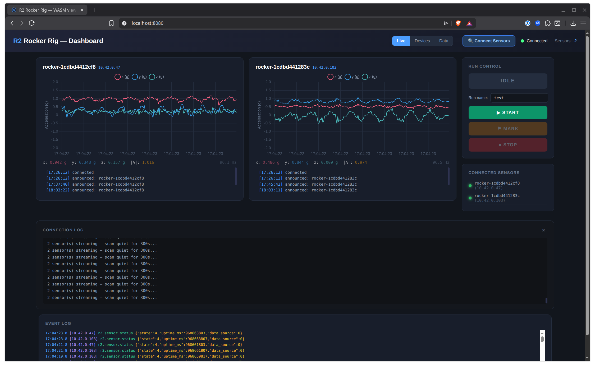
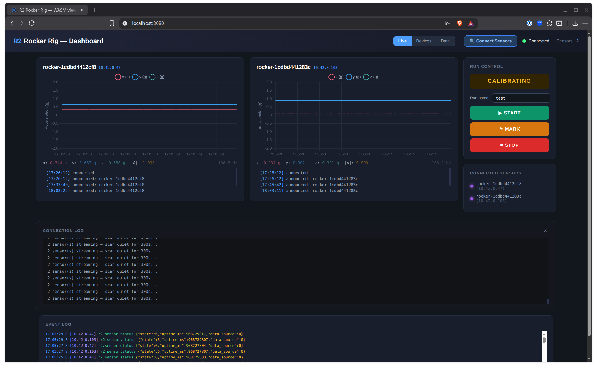
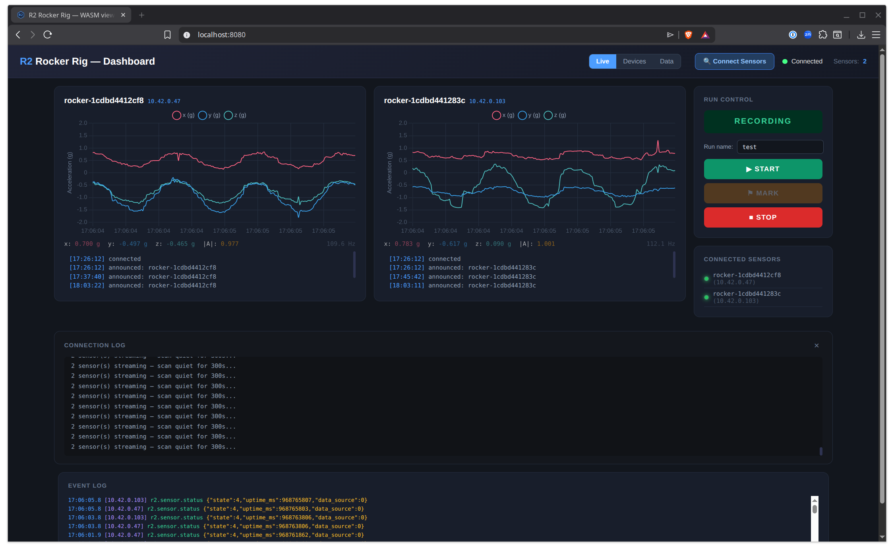
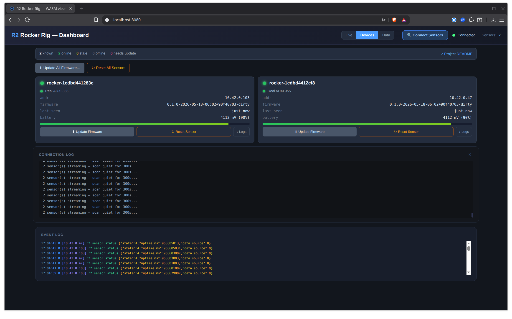
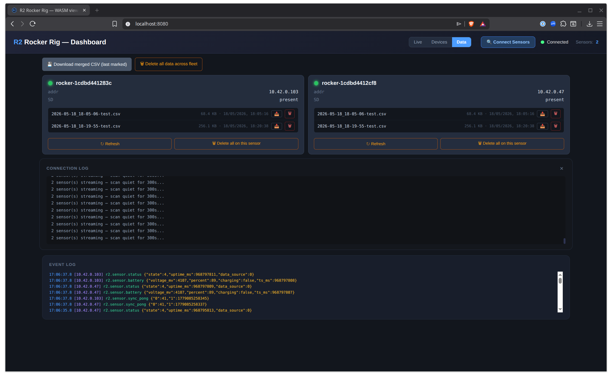

# r2-rocker

A wireless sensor system for monitoring a tyre-testing rig.

## What this does, in one paragraph

There's a half-tonne machine in a lab that studies how tyre rubber
wears against road surfaces. The asphalt sits as a flat bed at the
bottom; a slab of rubber sample is mounted on the *rocker* — the
moving upper part — and is driven back and forth across the asphalt
by hydraulic actuators to simulate a tyre travelling over a road.
The actuators bolt to the rocker through metal joints, and these
joints are showing stress in a way that suggests the rocker is
moving *sideways* a tiny bit when it's only meant to move *along
the direction of travel*. r2-rocker is the instrument that watches
for that sideways motion. Small battery-powered sensors clip onto
each joint, send their accelerometer readings live to a laptop on
the lab bench, and the laptop computes the difference in sideways
motion between joints — which is what we believe correlates with
the joint-shear failure mode.

The hardware is open. The protocol stack is open. The whole thing is
designed to be handed off to a university group, who can run, modify,
or extend it without depending on any third-party service.

Although r2-rocker was built for this specific tyre-wear rig, the
shape of the system — battery-powered ESP32 sensors streaming over
a local WiFi hotspot to a controller-hosted dashboard with durable
SD-card buffering, BLE bootstrap, OTA, and end-to-end signing —
isn't tyre-rig-specific. Any sensor that can be wired to an ESP32
(accelerometers, temperature, strain gauges, environmental,
chemical, hall, magnetometer, microphone, current sense, …) fits
the same template. Swap the ADXL355 driver in the firmware for
your sensor of choice, adjust the wire schema, and the rest of the
stack — hotspot, dashboard, web app, OTA, SD ring, time-sync,
log fan-out — applies unchanged. WiFi-range coverage is the only
hard constraint on physical deployment.

The protocol stack underneath the rig is **Reality2 (R2)** — an
open messaging substrate for distributed sentant-based systems. See
[reality2.ai](https://www.reality2.ai) for the wider project that
r2-rocker is built on; the R2 specs and reference crates this repo
vendors live under [`crates/`](crates/) and [`specifications/`](specifications/).

## What you'll find in the box

This project has three kinds of device:

| | What it is | What it does |
|---|---|---|
| **Sensors** | Small ESP32-based boards (microcontroller + accelerometer + battery + SD card) | Sit on the rig at each joint. Sample motion ~100 times a second. Send the readings to the controller over WiFi. |
| **A controller** | Any Linux machine — your laptop, or a Raspberry Pi | Hosts a private WiFi hotspot the sensors join. Receives sensor data over that WiFi. Serves a web app you use to monitor and control the rig. Stores data locally. |
| **Viewers** | Any device with a web browser — laptop, tablet, phone | Show live data. From a few metres away (over the controller's hotspot) or from anywhere on the internet (over a relay). The controller chooses what each viewer is allowed to see and do. |

You always need at least one sensor and one controller. Viewers are
optional — the controller's own browser counts as a viewer.

## How it fits together

```
                ┌──────────────────────────┐
                │  Operator's browser      │   The web app: see live
                │  (laptop / phone /       │   data, manage devices,
                │   tablet)                │   push firmware updates.
                └──────────▲───────────────┘
                           │ encrypted
                           │
                ┌──────────┴───────────┐         ┌────────────────────┐
                │  Controller          │  HTTPS  │  GitHub repo +     │
                │  (on the rig floor)  ├────────►│  Releases          │
                │  · Hosts WiFi        │ (poll)  │  (latest .bin)     │
                │  · Holds the keys    │         └────────────────────┘
                │  · Stores the data   │         Optional — only needed
                │  · Caches GitHub     │         to surface "new
                │    firmware locally  │         firmware available"
                └──────────▲───────────┘         and pull binaries.
                           │ WiFi (controller's hotspot)
                           │
                      ┌────┴────┐
                      │ Sensors │   Small boards on the rig joints.
                      └─────────┘
```

Things this implies that may surprise you if you've used a "normal"
cloud-app:

- **There's no central web server in the cloud holding your data.**
  Data lives on each sensor's SD card, plus the controller's local
  archive. If you want long-term offsite storage you can set it up,
  but it's optional and you own it. Nothing leaves the lab unless you
  decide it does.
- **Security is part of the protocol, not bolted on.** Sensors and
  the controller hold cryptographic keys; everything they send is
  signed and encrypted. A device that doesn't hold the right keys
  can't decode anything passing through, even if it's plugged into
  the same network.
- **The web app doesn't live on a server.** It loads as a small
  bundle of files into your browser, and once loaded it talks
  directly to the controller (or, for remote viewers, through a
  relay that just forwards sealed envelopes — it can't read them).
  This means the same app works onsite (no internet needed) and
  remotely (over the internet) without any change.
- **Browsers join temporarily.** When you want to view data on a new
  device, the operator presses a button on the dashboard which makes
  a QR code (or shareable link). Scanning it pairs that browser. No
  accounts, no passwords. The pairing can be revoked any time.
- **Closed-network deployments work without any internet.** A
  controller laptop, two sensors, and a tablet on the controller's
  hotspot are a complete instrument. No cloud, no GitHub, no
  third-party service. The GitHub link shown on the right of the
  diagram above is *only* used by the dashboard to surface "new
  firmware available" and pull binaries on demand; when the
  controller is offline it falls back to firmware in
  `firmware/esp32-s3/<carrier>/releases/` on its local disk and
  the rig keeps running.

## What it looks like

The operator-facing surface is a single web page served by the
controller. Three tabs cover everything routine:

**Live** — real-time accelerometer charts, one card per sensor,
plus the run-control buttons (Start → Mark → Stop). The "test"
run name field at the top right is what each capture file is
named after; the date prefix is added automatically:



**Run control flow.** Pressing **Start** sends a sync-pulse round
to every sensor and puts the fleet into calibration. Sensors
sample for ~2 seconds at rest to learn their per-axis offset; the
state indicator turns amber:



Then **Mark** locks the offset, opens the named CSV file on every
sensor's SD card, and starts writing calibrated rows. The Live
chart now shows the offset-subtracted signal — exactly what's
landing on disk:



**Devices** — fleet status. Real-vs-simulated ADXL355, firmware
version, last-seen, battery cell voltage. Per-card *Update Firmware*
and *Reset Sensor* buttons; their fleet-wide equivalents sit above
the cards:



**Data** — every capture file from every sensor, with per-file
download (📥), per-file delete (🗑), per-sensor delete-all, plus the
fleet-wide "Download merged CSV" that produces a single
wide-format file with one column-triple per sensor (see
`SPEC-R2-ROCKER-CAPTURE` §7.3):



---

## Reference hardware

You need:

- **One ESP32-S3-DevKitC-1-N8R8** development board per sensor.
  (Available from most electronics distributors. ~NZD 50.)
- **One ADXL355-PMDZ** accelerometer module per sensor. (Analog
  Devices' evaluation board for the ADXL355 chip. ~NZD 100.)
- **One microSD card breakout + microSD card** per sensor (any
  capacity ≥ 4 GB). For local data buffering.
- **One single-cell LiPo battery** per sensor (3.7 V, 1–2 Ah, JST-PH
  connector). Removable for off-rig charging.
- **One 3.3 V buck-boost regulator module** per sensor (Pololu
  S7V8F3 or equivalent). Sits between the LiPo and the DevKitC's
  3V3 rail so the chip sees a stable 3.3 V across the cell's full
  3.0–4.2 V discharge curve — without it, both ends of the curve
  cause flaky behaviour (chip resets near empty, SD/ADXL355
  marginal at peak).
- **One Linux laptop or Raspberry Pi** as the controller, with
  **two WiFi adapters**: one for the lab's usual internet, one
  dedicated to hosting the sensor hotspot. Strongly recommended,
  not optional — the controller's bootstrap engine refuses to host
  a hotspot on the internet-carrying adapter (it would knock the
  controller off the lab network), so a single-WiFi machine can't
  do both jobs at once. A cheap USB WiFi dongle alongside the
  built-in radio is plenty. Wired ethernet for the internet side
  also frees up the built-in WiFi for the hotspot.
- **Female-to-female DuPont jumper wires** (about 6 per sensor, for
  the Pmod-to-DevKitC connection).
- **Two 100 kΩ resistors** + **one 100 nF ceramic cap** per sensor —
  for the battery-sense voltage divider (see
  `specifications/HARDWARE-WIRING-DEVKITC.md` §4.2). The cap is the
  important one: without it the ADC can't sample the high-impedance
  divider correctly and the firmware falls back to a simulated
  battery feed.

The full wiring is in [`specifications/HARDWARE-WIRING.md`](specifications/HARDWARE-WIRING.md).

## Setting it up the first time

You only do this once per fresh checkout.

```bash
# 1. Get the source.
git clone https://github.com/reality2-ai/r2-rocker
cd r2-rocker

# 2. Install the Rust embedded toolchain (one-time, ~5 minutes).
#    Espressif's installer for the Xtensa toolchain the firmware needs.
cargo install espup
espup install
# Source the toolchain into your shell. Add to your ~/.bashrc /
# ~/.zshrc to do this automatically on future shells:
source ~/export-esp.sh

# 3. One-time firmware build setup.
./tools/setup-firmware.sh

# 4. Generate the cryptographic keys for your deployment. Run ONCE
#    per rig. The private key MUST be stored outside the repo
#    (e.g. an encrypted USB key); only the public key + cert get
#    committed. See specifications/SECRETS-POLICY.md.
cargo run -p r2-rocker-tg -- keygen \
    --priv  ~/secure/tg_priv.bin \
    --pub   trust_keys/tg_pub.bin \
    --cert  trust_keys/tg_cert.bin \
    --name  "my-rocker-rig"
```

## Day-to-day operation

After the first-time setup, normal use is:

```bash
# 1. Bring up the lab WiFi hotspot the sensors will join.
#    --rotate generates fresh credentials; without it, the previous
#    credentials are reused.
./tools/setup-hotspot.sh

# 2. Build the firmware for your carrier (devkitc or xiao — defaults
#    to devkitc). Produces TWO files: one for cabled flashing, one
#    archived under firmware/esp32-s3/<carrier>/releases/ for posterity.
./tools/build-firmware.sh devkitc

# 3. Flash a fresh sensor over USB. The DevKitC's USB-OTG port shows
#    up as /dev/ttyACM0 on Linux. Only needed once per chip — after
#    that, updates push wirelessly.
cd firmware/esp32-s3/devkitc && source ~/export-esp.sh
cargo espflash flash --release --port /dev/ttyACM0
cd ../../..

# 4. Start the dashboard. Prints a banner with version + ports.
#    The dashboard also serves the web app from `webapp/` at the
#    root of the same HTTP port — no separate webapp server needed.
cargo run --release -p r2-dashboard

# 5. Open http://localhost:8080/ in your browser.
# 6. Click "Connect Sensors" and watch the LEDs.
```

The sensor's small RGB LED tells you what it's doing at a glance:

| LED | Meaning |
|---|---|
| Quick white flash | Just powered on. |
| Pulsing blue | Looking for a controller (no WiFi credentials yet). |
| Pulsing cyan | Joining the WiFi network. |
| Steady-heartbeat green | Connected, streaming data. |
| Strobing white | Receiving a firmware update. |
| Pulsing orange | Battery low. |
| Pulsing red | Something went wrong; reset and try again. |

The dashboard's web app shows a virtual copy of each sensor's LED
next to the device's name, so you can see the same status from across
the room.

## Updating firmware wirelessly

Once a sensor has been flashed once over USB, you don't need the
cable again:

```bash
./tools/build-firmware.sh devkitc        # produces a new .bin
```

In the dashboard, switch to the **Devices** tab, click *Update
Firmware* on the sensor's card, and pick the new `.bin` file
(`firmware/esp32-s3/devkitc/target/xtensa-esp32s3-espidf/release/r2-rocker-firmware.bin`).
The sensor receives the image, checks its integrity, writes the
inactive partition, reboots into the new firmware, and rejoins.
Takes about 15 seconds.

To update every sensor at once, click **Update All Firmware…** at
the top of the Devices view and pick the same `.bin`. Sensors
already running that build (matched by the filename's `fw_ver`
stamp) are skipped; the rest get the push in parallel. The
companion **Reset All Sensors** button does the same fan-out
for a fleet reboot.

If the new firmware is broken — can't join WiFi, or can't reach the
dashboard — the bootloader notices on the next boot and rolls back
to the previous version automatically. So you can't accidentally
brick a sensor over the air.

Every wireless-update build is also archived under
`firmware/esp32-s3/<carrier>/releases/` with the version string in
the filename, so you can always find the exact bytes a given sensor
is running.

## Building a new firmware version by hand

`tools/build-firmware.sh` wraps three steps. If you'd rather run
them yourself (or are debugging the build):

```bash
# Step 1: source the ESP toolchain into the current shell.
source ~/export-esp.sh

# Step 2: compile. The carrier subdirectory you `cd` into is what
#         picks devkitc vs xiao pin maps; the firmware crate is the
#         same code, parameterised by a per-carrier Cargo manifest.
cd firmware/esp32-s3/devkitc
cargo build --release

# Step 3: convert the ELF into an ESP image (the .bin format the
#         OTA flow understands). `espflash flash` does this
#         internally; `espflash save-image` just writes the
#         conversion out to disk without flashing.
espflash save-image --chip esp32s3 \
    target/xtensa-esp32s3-espidf/release/r2-rocker-firmware \
    target/xtensa-esp32s3-espidf/release/r2-rocker-firmware.bin
```

The resulting `target/xtensa-esp32s3-espidf/release/r2-rocker-firmware.bin`
is what `/api/ota/{addr}` accepts. The release archive copy under
`releases/` is purely for posterity — the build script copies it
there but it's not on the OTA path.

The `fw_ver` string the firmware reports in its announce (and that
the dashboard's device card shows) is stamped by the firmware's
`build.rs` from `git rev-parse HEAD` + `date -u`. Edit any source
file, commit, or modify the index and `build.rs` re-runs on the
next `cargo build` so the stamp tracks the actual binary. The
"App version" line in the ESP-IDF boot banner is **separate** — it
comes from a CMake-generated source file that only refreshes on a
full IDF reconfigure (i.e. after `cargo clean`). Use the announce
string in the dashboard, not the boot banner, as the source of
truth for what's running.

## Rebuilding the web app from source

The web app at `webapp/` is plain HTML + JS, plus a `pkg/`
sub-directory containing a WebAssembly bundle compiled from
`crates/r2-wasm`. The dashboard binary serves `webapp/` over HTTP
(port 8080) — nothing in this directory is bundled into a separate
build artefact, so an `index.html` edit is live on the next page
reload (the service worker caches assets; bump `CACHE` in
`webapp/sw.js` to force-refresh every connected browser).

To rebuild the WebAssembly bundle (only needed when `crates/r2-wasm`
or any of its R2-stack dependencies change):

```bash
# One-time: install wasm-pack if you don't have it.
cargo install wasm-pack

# Rebuild webapp/pkg/ from crates/r2-wasm/.
wasm-pack build crates/r2-wasm --target web --release \
    --out-dir ../../webapp/pkg
```

Output lands at `webapp/pkg/`. The HTML in `webapp/index.html`
imports `./pkg/r2_wasm.js`. There is no separate dev server — open
the dashboard's HTTP port (`http://localhost:8080/`) and you have
the freshly-rebuilt viewer. Hard-refresh the browser (or bump the
service worker cache key) if a stale cached version sticks.

## Where to look when something doesn't work

| Symptom | First place to look |
|---|---|
| LED stays dark | Battery dead or USB-OTG cable not seated. |
| LED pulses red | Hardware fault. Look at the serial console — `cat /dev/ttyACM0` (after `stty -F /dev/ttyACM0 115200 raw`). |
| Sensor never connects | Check the hotspot is up (`./tools/setup-hotspot.sh status`). Check the WiFi credentials match. Try clicking *Connect Sensors* on the dashboard to push fresh credentials over Bluetooth. |
| Dashboard says "no peers" | The TCP listener is on port 21042. Check no firewall is blocking it. |
| OTA update fails | Bootloader will roll back to the previous firmware on the next sensor reboot — usually within 30 seconds. Then you can try the update again. |
| Live data stops mid-session | The sensor probably disconnected from WiFi. Its LED tells you what state it's in. The dashboard's "last seen" age shows how long it's been silent. |

For deeper diagnosis, the dashboard prints all events and errors to
its terminal. The Connection Log panel in the web app shows the same
information.

## Repo layout

```
r2-rocker/
├─ Cargo.toml                ← workspace root (the dashboard, tools, and protocol crates)
├─ crates/                   ← protocol building blocks (compact frames, CBOR, crypto)
├─ dashboard/                ← the controller's web server (Rust)
├─ firmware/esp32-s3/        ← sensor firmware (Rust on Xtensa)
├─ webapp/              ← the web app (HTML + JS + WASM bundle)
├─ tools/                    ← scripts and CLIs (build, flash, key generation, setup)
├─ trust_keys/               ← public keys + cert (PRIVATE KEY NEVER LIVES HERE)
├─ specifications/           ← spec-first source of truth for what the system does
├─ plan/PLAN.md              ← living roadmap: what's done, what's next, why
├─ conversation/             ← per-session design records (raw material for the paper)
├─ docs/                     ← vendor PDFs (datasheets) and reference materials
├─ AI-CONTEXT.md             ← entry-point doc for AI assistants helping with the project
├─ PROCESS.md                ← five workflow rules we follow
└─ README.md                 ← this file
```

## Project status

End-to-end works wirelessly today: real ESP32-S3 hardware with
real ADXL355 chips, the dashboard's bootstrap loop discovers them
over Bluetooth, pushes WiFi credentials, sensors reboot into WiFi,
stream live acceleration to the dashboard, accept firmware updates
over the air, and write named captures to SD with calibrated values
+ a wide-format fleet merge for analysis. LED state, battery state,
and on-screen indicators are all in lockstep.

What's left before the rig is "production-ready":

- Sign + verify firmware updates and WiFi-credential offers (the
  cryptography primitives are in place; the integration is the next
  piece of work).
- Onsite long-term data archive.
- Remote-viewing rollout — the spec is written, implementation is
  staged across several incremental milestones.
- Real battery telemetry on every sensor (firmware ready; needs the
  100 nF bypass cap fitted across the voltage divider, see
  `specifications/HARDWARE-WIRING-DEVKITC.md` §4.2).

`plan/PLAN.md` has the full roadmap with current status against each
milestone.

## Glossary

A few terms used elsewhere in the docs that don't appear in this
README:

- **Trust group / TG** — the set of devices (sensors, controller,
  viewers) that share cryptographic keys and trust each other. There
  are two trust groups in this project: one for sensors+controller
  ("production"), one for viewers ("viewing"). They talk to each
  other through a controlled bridge on the controller.
- **R2 / Reality2** — the underlying messaging protocol stack. It
  defines how devices identify themselves, encrypt traffic, route
  messages across intermittent networks, and bootstrap new members.
  See [reality2.ai](https://www.reality2.ai) for the upstream project.
- **OTA** — over-the-air firmware update. The "wireless update"
  feature.
- **BLE** — Bluetooth Low Energy. Used briefly during sensor setup
  to deliver WiFi credentials before a sensor knows how to join the
  network.
- **R2-WIRE** — the binary message format sensors use to send
  events. Compact (12-byte header + payload), so a battery-powered
  sensor can stream it cheaply.
- **Sentant** — a small piece of code inside a device that handles
  one kind of event. The dashboard, the firmware, and the web app
  are each made of several sentants composed into an "ensemble".
- **Hive** — a single device running a set of sentants. Each sensor
  is a hive; the controller is a hive; each browser viewer is a
  hive.

## Reading order

If you're new and want to understand the whole thing:

1. This README.
2. [`PROCESS.md`](PROCESS.md) — five rules for how we work on this project.
3. [`plan/PLAN.md`](plan/PLAN.md) — what we're building, in what order, and why.
4. [`specifications/HARDWARE-WIRING.md`](specifications/HARDWARE-WIRING.md) — physical sensor build (pinouts, photos).
5. [`specifications/SECRETS-POLICY.md`](specifications/SECRETS-POLICY.md) — before you touch any keys.
6. The latest entry in [`conversation/`](conversation/) — the most recent thinking, in raw form.

For AI assistants helping with the project: read
[`AI-CONTEXT.md`](AI-CONTEXT.md) first; it's a curated entry point.

The full normative specs are under [`specifications/`](specifications/):

- `SPEC-R2-ROCKER-SYSTEM.md` — the system as a whole.
- `SPEC-R2-ROCKER-WIRE.md` — the message format on the wire.
- `SPEC-R2-ROCKER-SENSOR.md` — what the sensor firmware does.
- `SPEC-R2-ROCKER-SENTANTS.md` — the **sentant + plugin catalog**
  that makes up the sensor firmware (one row per building block,
  with the events it consumes / produces). The intended workflow
  is to compose the firmware from these descriptions — re-use a
  sentant in another ESP32 sensor build by porting the file and
  declaring its plugin dependencies.
- `SPEC-R2-ROCKER-DASHBOARD.md` — what the controller does.
- `SPEC-R2-ROCKER-TIMESYNC.md` — the time-sync hybrid model.
- `SPEC-R2-ROCKER-SENSOR-HEALTH.md`,
  `SPEC-R2-ROCKER-SENSOR-REMOTE-RESET.md`,
  `SPEC-R2-ROCKER-SENSOR-LIVE-LOGS.md` — sensor-side feature specs.
- `SPEC-R2-ROCKER-BRIDGE.md` — how the production and viewing trust
  groups talk to each other.
- `HARDWARE-WIRING.md`, `SECRETS-POLICY.md` — operational specs.

## License

To be decided before public / university release.

[r2]: https://github.com/reality2-ai
